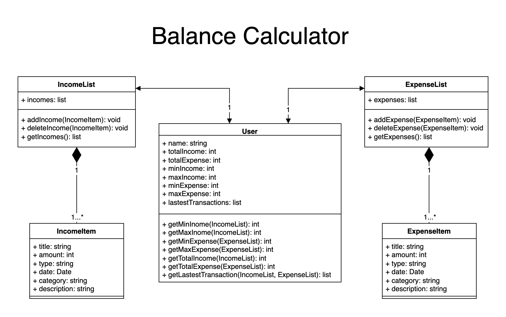

# Balance Calculator

## Description
This project is a balance calculator that allows users to track their income and expenses. Users can view their income and expense details, total value, and current balance. They can also add or delete an income or expense record. Each detail includes information such as date, category, description, and more, providing users with a comprehensive overview of their finances.

In addition to the financial tracking features, our project includes a dashboard that displays daily news, weather forecast, currency exchange modules for user convenience. Furthermore, we have incorporated a visualization module to help users have a better understanding of their incomes and expenses condition by providing the monthly overview.

## User Story
1. As a user, I want to be able to view my total income, expense and balance.
2. As a user, I want to be able to view my latest income and expense records on the dashboard.
3. As a user, I want to be able to view my income and expense range.
4. As a user, I want to be able to add/edit an income or expense statement including title, amount, date, description, and location.
5. As a user, I want to be able to delete an income or expense statement.
6. As a user, I want to be able to have a clear and easy-to-understand visualization of my spending category distributions.
7. As a user, I want to be able to have a income and expense overview by months.
8. As a user, I want to be able to view the real-time weather condition of selected city.
9. As a user, I want to be able to view the future weather forecast of my selected city.
10. As a user, I want to be able to view the today's news.
11. As a user, I want to be able to view the locations of my transaction.
12. As a user, I want to be able to use currency exchange tool to do currency calculation based on the real-time exchange rate.


## Milestones
#### Milestone 1: Calculator dashboard
- Total income, expense and balance; Income and expense range
- Latest transactions
- Add and delete income/expense statement

#### Milestone 2: Income & Expense Visualization
- Add visulization to the income & expenses overview 

#### Milestone 3: Weather dashboard
- View the real-time weather condition of my desired city

#### Milestone 4: News dashboard
- View the today's news

#### Milestone 5: Google Map dashboard
- Add location of transaction statement
- View locations in map

#### Milestone 6: Currency Exchange dashboard
- Function as currency calculator

## Object Model



## OpenAPI Specification
We will create an OpenAPI Specification Yaml file that includes the description, request method, request body, response format, error response format, and any required schemas for each of the REST API resources listed above. The spec will also include examples of parameters and object properties.

## Enviroment Setting and Rnnning the Project
Make sure you have successfully install node,npm,react in your local environment

### 1. Clone to project to you local
```
Use git clone command
```
### 2. Set up local MongoDB Database
Make sure your MongoDB is working

#### Using Compass as MongoDB Management Tool:

* In localhost:27017
* Create Database:balancedb
* Create Collection:incomes
* Create Collection:expenses

### 3. Move to project root folder and excute

```
npm init -v
```
### 4. Make sure you have node.JS installed in your local environment 
Then move to backend folder in your terminal
```
npm install

node app.js
```
### 5. Open a new terminal and go to the frontend folder
```
npm install

npm start
```

### 6. Open the browser
For example:
Go to the local server address: http://localhost:5000/
